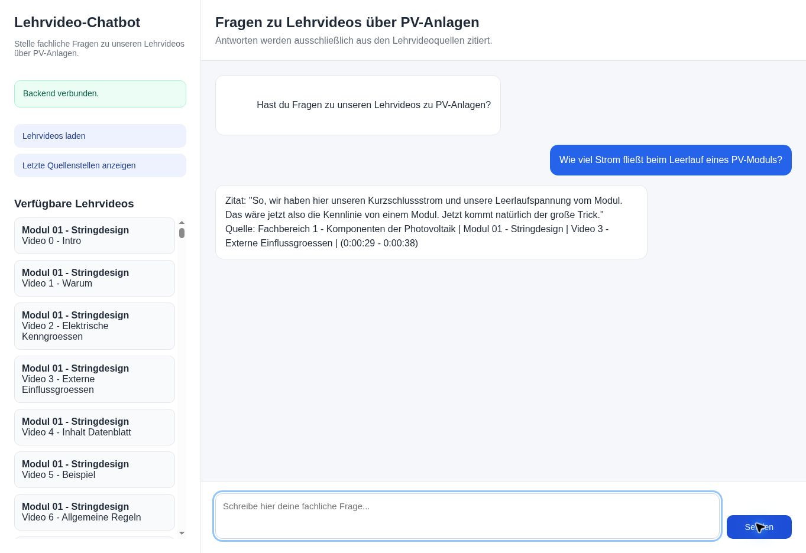

# Live-Abnahme am 4. Oktober 2026

Zehn Entwicklungsfragen wurden an https://mybrainday.onrender.com/ gestellt.
Vor jeder Frage wurde die Seite neu geladen, damit kein vorheriger Dialog die
Antwort beeinflusst. Anschließend wurde jeweils „Letzte Quellenstellen“ geöffnet.
Es handelt sich um einen einzelnen Durchlauf eines kleinen, assistentenkuratierten
Entwicklungssets, keine repräsentative allgemeine Qualitätsmessung.

## Ergebnis

| Frage / ID | Zitate | Hinterlegte Belege vollständig? | Beobachtung |
|---|---:|---|---|
| Leerlauf / pv-open | 3 | Ja | Schalter geöffnet, Anschlüsse getrennt |
| OC / pv-uoc | 2 | Ja | Gesuchte Begriffserklärung enthalten |
| Leerlaufstrom / pv-current | 1 | Nein | Kennlinie erwähnt, Stromwert fehlt |
| STC / pv-stc | 1 | Ja | Wert und Einheit enthalten |
| Einstrahlung / pv-irradiance | 6 | Ja | Antwort enthalten, zusätzliche Abschweifungen |
| Airmass / pv-airmass | 2 | Ja | Gesuchter Wert enthalten, weitere Beispiele |
| N / trafo-n | 13 | Ja | Antwort enthalten, viele zusätzliche Themen |
| Phasenwinkel / trafo-angle | 2 | Ja | Zahl und Winkel enthalten |
| Großbuchstaben / trafo-case | 3 | Ja | Zuordnung enthalten, mehrfach erklärt |
| Verluste / trafo-losses | 8 | Teilweise | Einer von zwei Referenzabschnitten; alternative Erklärung enthalten |

8 von 10 Antworten enthalten das vollständige hinterlegte Referenzset.
Bei der Verlustfrage wird die Referenz „Leerlaufverluste, die sind immer da“
nicht ausgegeben. Stattdessen erläutert ein anderer Abschnitt die dauerhafte
Magnetisierung; der lastabhängige Anstieg der Kurzschlussverluste wird wörtlich
zitiert. Daher ist die fehlende Referenz kein Beweis für eine falsche Antwort.
Der Antwortumfang ist allerdings groß und enthält Details zu einem Laborversuch,
obwohl nach dem Unterschied in Abhängigkeit von der Belastung gefragt wurde.

Alle 41 ausgegebenen Zitate stimmen mit den Originalstellen und ihren Metadaten
überein. Alle zehn Antworten entsprechen dem reinen Zitat-/Quellenformat.
In allen zehn Quellenfenstern sind sämtliche zugehörigen Chat-Zitate samt
Fachbereich, Modul, Video und Zeitstelle vorhanden. Diese Prüfungen sind
automatisch aus den gespeicherten sichtbaren Texten reproduzierbar.

## Reproduzierter Fehler

Frage: „Wie viel Strom fließt beim Leerlauf eines PV-Moduls?“

Ausgegeben wird in beiden geprüften neuen Sitzungen die Passage aus Modul 01,
Video 3, `(0:00:29 - 0:00:38)`: „So, wir haben hier unseren Kurzschlussstrom
und unsere Leerlaufspannung vom Modul. Das wäre jetzt also die Kennlinie von
einem Modul. Jetzt kommt natürlich der große Trick.“

Diese Passage nennt keinen Leerlaufstrom. Die benötigte Stelle liegt in Modul
01, Video 2, `(0:02:02 - 0:02:16)` und enthält ausdrücklich „null Ampere“.
Die UI-Beobachtung allein zeigt nicht, ob diese Stelle bereits bei der Suche
fehlt oder ob die Auswahl sie verwirft. Ein pauschal größeres Nachbarfenster
um Video 3 kann eine Stelle in Video 2 nicht erschließen.

## Konsequenz

Vor weiteren Prompt- oder Retrievaländerungen muss der vollständige Ablauf
Suchanker → Kontext → finale Zitate verglichen werden. Dafür wurde der
Evaluationslauf um `--answers` ergänzt. Der lokale vollständige Cache und ein
OpenAI-Schlüssel waren in dieser Arbeitsumgebung nicht vorhanden; interne
Rankings konnten deshalb noch nicht erhoben werden. Die UI-Prüfung ersetzt
diese Diagnose nicht. Der Fehler ist nachgewiesen, aber noch nicht behoben.

Der zweite Befund ist eine zu breite Zitatauswahl (bis 13 Zitate bei einer
Begriffsfrage). Nach Lokalisierung des Hauptfehlers sollten Varianten auf
vollständige Antwortbelege und unnötige Zusatzpassagen geprüft werden. Eine
starre Kürzung auf die ersten Zitate wäre keine sichere Lösung, weil sie
erforderliche Bedingungen oder den eigentlichen Ergebnisabschnitt entfernen kann.

## Nachweisgrenzen

Der genaue Live-Commit wird nicht durch den Dienst ausgewiesen. PR #6 war
zum Prüfzeitpunkt gemergt; dies allein bestätigt keinen abgeschlossenen Deploy.
Es gibt keinen Vorher-Nachher-Lauf und daher keinen gemessenen Verbesserungswert.
Die Referenzen wurden gegen fünf benötigte Transkripte im Repository geprüft,
nicht gegen einen exportierten Produktionsindex. Die fachliche Richtigkeit der
Transkripte sowie nicht beantwortbare Fragen wurden nicht bewertet.
